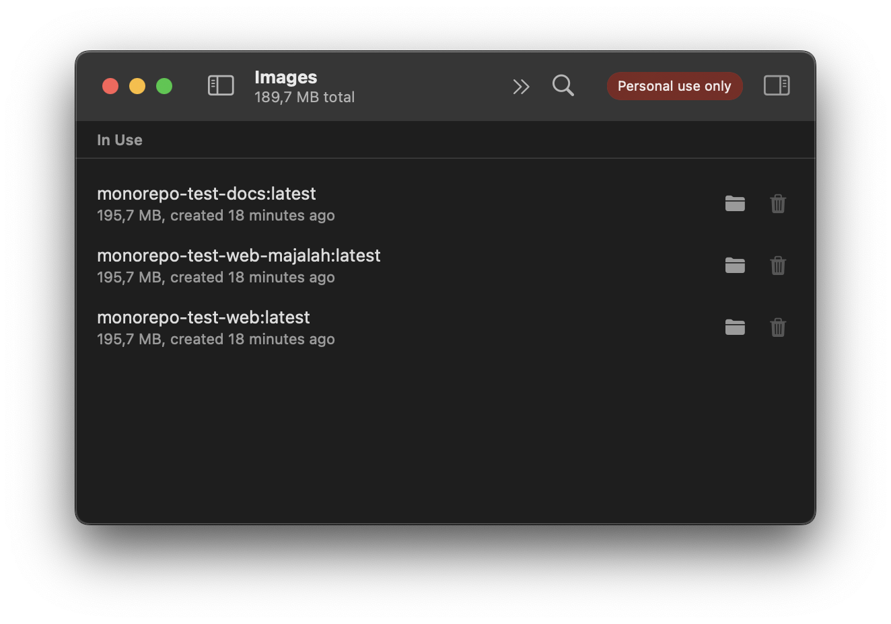
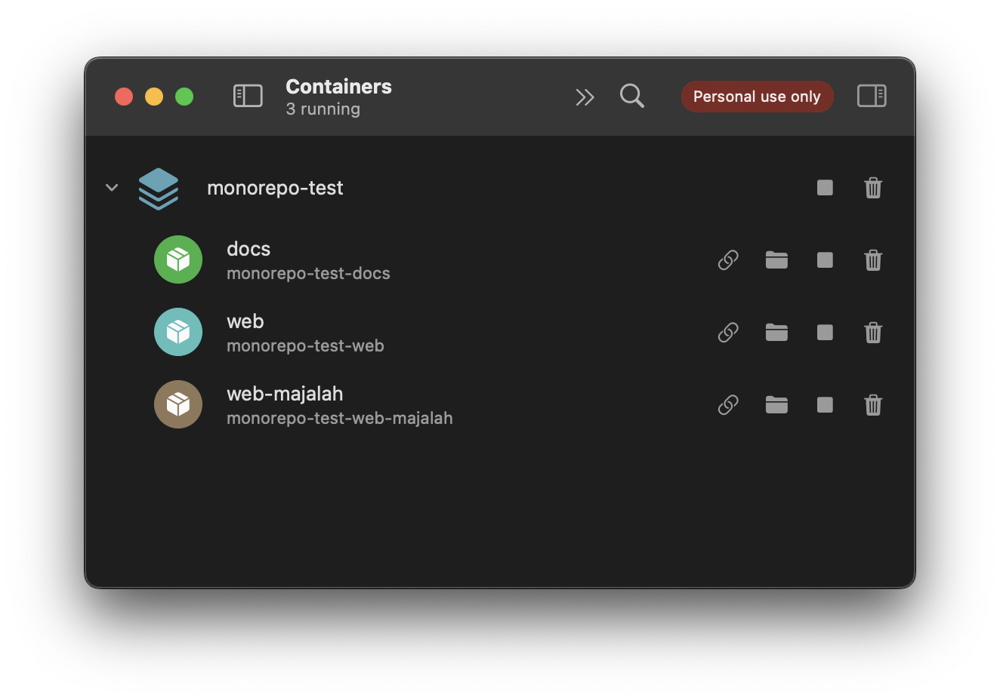

# About Project

Proyek ini menggunakan Docker untuk containerization, yang memungkinkan Anda untuk menjalankan aplikasi dalam lingkungan yang terisolasi. Berikut adalah langkah-langkah untuk menjalankan proyek ini dalam mode produksi dan pengembangan.

# Structure

```sh
root/
│-- apps/
│   │-- web/
│   │   -- .
│   │   -- .
│   │   -- Dockerfile
│   │-- docs/
│   │   -- .
│   │   -- .
│   │   -- Dockerfile
│   │-- web-majalah/
│   │   -- .
│   │   -- .
│   │   -- Dockerfile
│-- packages/
│-- docker-compose.dev.yml
│-- docker-compose.yml
│-- Dockerfile.dev
│-- turbo.json
│-- package.json
│-- pnpm-workspace.yaml
```

Proyek ini memiliki dua file docker-compose:

- `docker-compose.yml`: Digunakan untuk menjalankan aplikasi dalam mode produksi.
- `docker-compose.dev.yml`: Digunakan untuk menjalankan aplikasi dalam mode pengembangan dengan hot reload.

# Production Mode

File `docker-compose.yml` mendefinisikan tiga layanan:

- `web`: Aplikasi utama yang - berjalan di port 3000.
  [http://localhost:3000/](http://localhost:3000/)
- `docs`: Aplikasi dokumentasi yang berjalan di port 3001.
  [http://localhost:3001/](http://localhost:3001/)
- `web-majalah`: Aplikasi majalah yang berjalan di port 3002.
  [http://localhost:3002/](http://localhost:3002/)

Contoh konfigurasi untuk layanan web:

```
services:
web:
  build:
    context: .
    dockerfile: ./apps/web/Dockerfile
  ports:
    - "3000:3000"
  environment:
    - NODE_ENV=production
```

# Evidences




# Mode Dev

File `docker-compose.dev.yml` mendefinisikan layanan yang sama dengan `docker-compose.yml`, tetapi dengan tambahan volume untuk mendukung hot reload:

```
services:
  web:
    build:
      context: .
      dockerfile: Dockerfile.dev
    container_name: turborepo-dev
    ports:
      - "3000:3000"
      - "3001:3001"
      - "3002:3002"
    volumes:
      - .:/app
```

### To run dev mode

```
docker-compose -f docker-compose.dev.yml up --build -d
```

# Turborepo starter

This is an official starter Turborepo.

## Using this example

Run the following command:

```sh
npx create-turbo@latest
```

## What's inside?

This Turborepo includes the following packages/apps:

### Apps and Packages

- `docs`: a [Next.js](https://nextjs.org/) app
- `web`: another [Next.js](https://nextjs.org/) app
- `@repo/ui`: a stub React component library shared by both `web` and `docs` applications
- `@repo/eslint-config`: `eslint` configurations (includes `eslint-config-next` and `eslint-config-prettier`)
- `@repo/typescript-config`: `tsconfig.json`s used throughout the monorepo

Each package/app is 100% [TypeScript](https://www.typescriptlang.org/).

### Utilities

This Turborepo has some additional tools already setup for you:

- [TypeScript](https://www.typescriptlang.org/) for static type checking
- [ESLint](https://eslint.org/) for code linting
- [Prettier](https://prettier.io) for code formatting

### Build

To build all apps and packages, run the following command:

```
cd my-turborepo
pnpm build
```

### Develop

To develop all apps and packages, run the following command:

```
cd my-turborepo
pnpm dev
```

### Remote Caching

Turborepo can use a technique known as [Remote Caching](https://turbo.build/repo/docs/core-concepts/remote-caching) to share cache artifacts across machines, enabling you to share build caches with your team and CI/CD pipelines.

By default, Turborepo will cache locally. To enable Remote Caching you will need an account with Vercel. If you don't have an account you can [create one](https://vercel.com/signup), then enter the following commands:

```
cd my-turborepo
npx turbo login
```

This will authenticate the Turborepo CLI with your [Vercel account](https://vercel.com/docs/concepts/personal-accounts/overview).

Next, you can link your Turborepo to your Remote Cache by running the following command from the root of your Turborepo:

```
npx turbo link
```

## Useful Links

Learn more about the power of Turborepo:

- [Tasks](https://turbo.build/repo/docs/core-concepts/monorepos/running-tasks)
- [Caching](https://turbo.build/repo/docs/core-concepts/caching)
- [Remote Caching](https://turbo.build/repo/docs/core-concepts/remote-caching)
- [Filtering](https://turbo.build/repo/docs/core-concepts/monorepos/filtering)
- [Configuration Options](https://turbo.build/repo/docs/reference/configuration)
- [CLI Usage](https://turbo.build/repo/docs/reference/command-line-reference)
